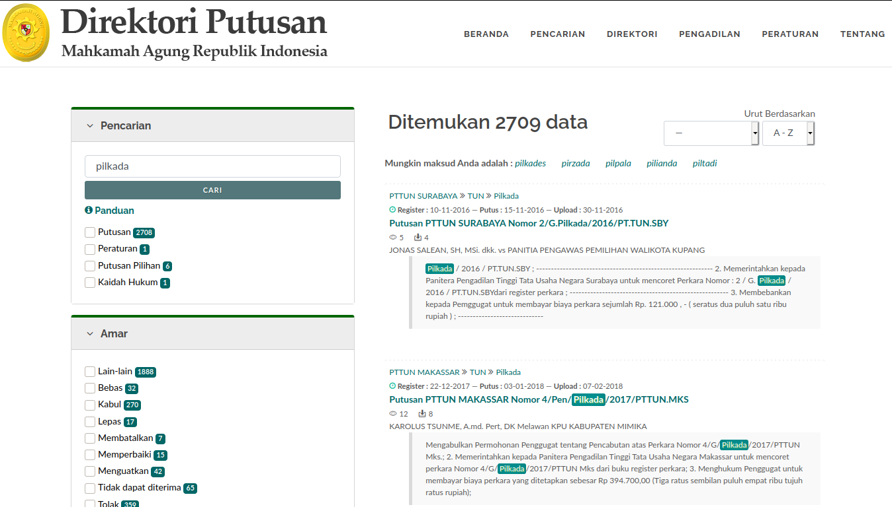
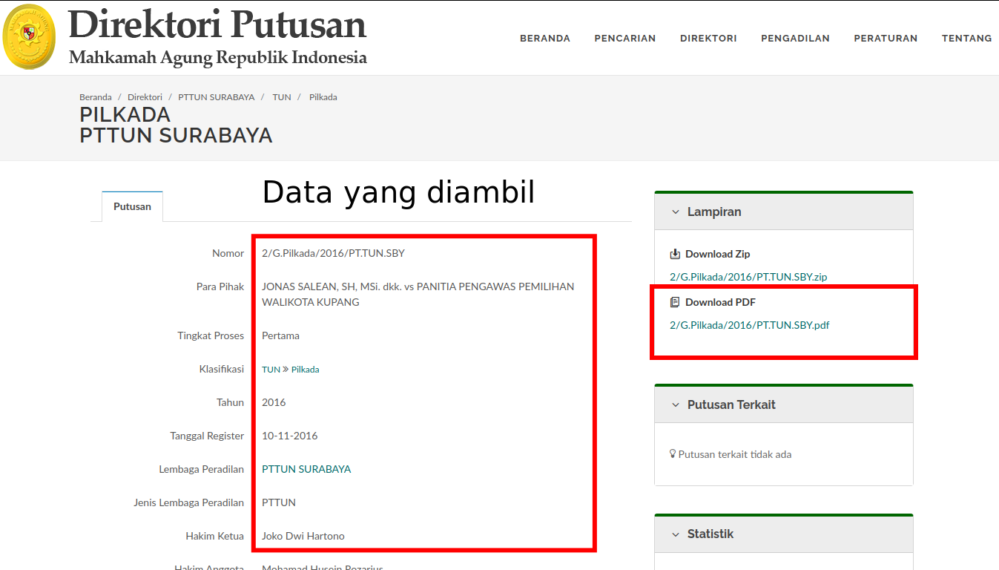

# Putusan Mahkamah Agung Data Scrapper

This code is used for scraping data on the website: [https://putusan3.mahkamahagung.go.id/search.html](https://putusan3.mahkamahagung.go.id/search.html)





## Usage and How to use

usage: filename.py -k "keyword"

Note: for task from campus, i set this code only retrieve data if link download pdf from web available

```
Optional arguments:
    -sd         Sort date (Scraping from newest) Default False
    -dp         Downloadpdf (Download pdf file) Default False
    -rg         Range (Limit range scraping from web based page) Default False
    -c          Count (Limit how many scraping from web based download pdf) Default False
```

